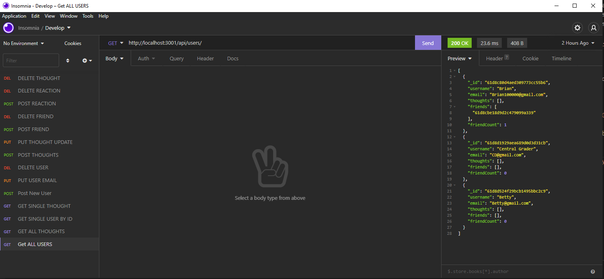

# Socail Network API #

 ## Table of Contents
* [Description](#description)
* [Installation](#installation)
* [Usage](#usage)
* [License](#license)
* [Contributors](#contributors)
* [Questions](#questions)

## Description
This Social Network API is a backend application to allow users to create an account, post thoughts, adds friends, comment on thoughts, and add reaction to different thoughts.
## Install
Make sure to clone the repo, then in the root directory run npm install (mongoose,express).
## Usage
This can be used to demonstrate the different types of methods and how to change or delete the information in a database using something to similar to a social media network where users can add each other and comment on each other's activity, in this case thoughts and add/remove reactions to those thoughts. 
## License

## Contributors
Christopher Tangarife
## Questions
If you have any questions about the application contact me directly at Christangarife95@gmailcom 
# Contact
Christangarife95@gmail.com 
# Username
Check out my other work on [Github](https://github.com/ChrisCodes54)
# Screenshots and Video Link to walkthrough
Watch the walkthrough video by clicking [here](https://drive.google.com/file/d/1EvbRmhxxhCYLGTQmmC6tgGZybo85hoB9/view?usp=sharing)

